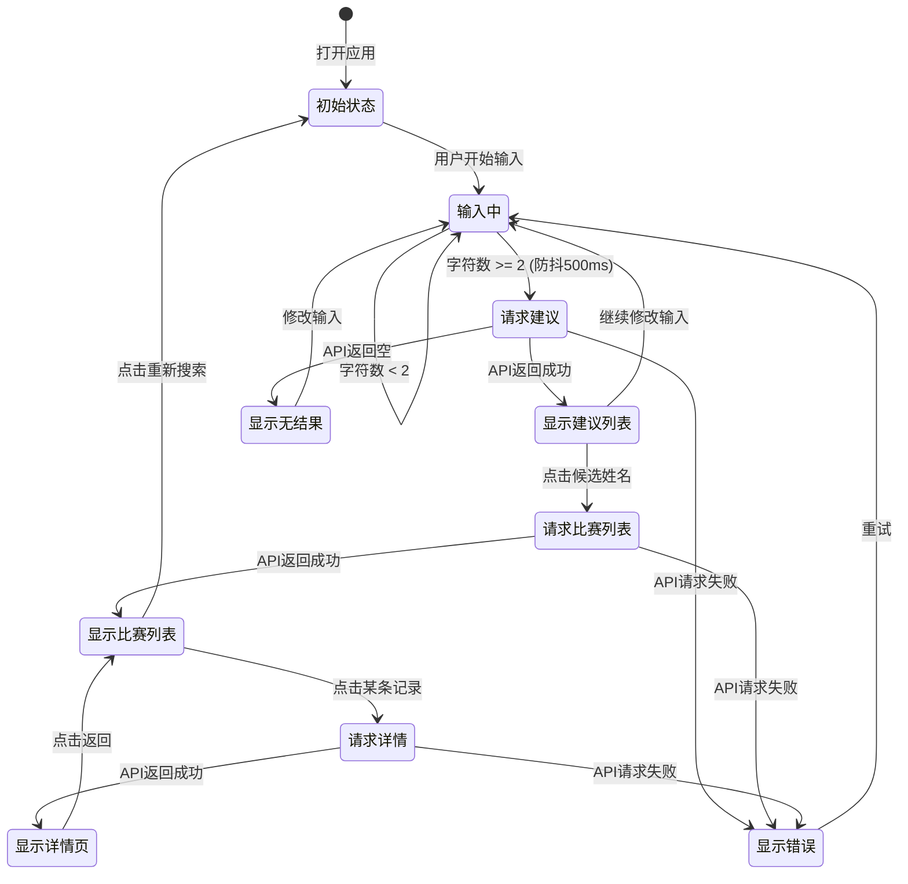

# PRD: v2.0 - 前端整合（Web 应用）

## 文档信息

| 项目 | 内容 |
|------|------|
| 版本 | v2.0 |
| 作者 | HyroxAgent Team |
| 创建日期 | 2026-01-20 |
| 状态 | 开发中 |
| 前置版本 | [v1.0-mvp](./v1.0-mvp.md) |
| 参考 | [Roxlab](https://www.roxlab.app) |

## 修订历史

| 版本 | 日期 | 作者 | 变更内容 |
|------|------|------|----------|
| 2.0 | 2026-01-20 | AI | 初稿：前端整合，React Web 应用对接后端 API |

---

## 1. 产品概述

### 1.1 背景

v1.0 MVP 已完成后端 API 开发，实现了运动员搜索和成绩详情查询功能。本版本（v2.0）目标是开发配套的 Web 前端应用，与后端 API 对接，提供完整的用户交互体验。

### 1.2 目标

基于 v1.0 后端 API，开发 React Web 应用，实现：
1. **两阶段搜索** - 名称建议 + 精确搜索
2. **比赛列表展示** - 展示运动员的比赛记录
3. **成绩详情页** - 展示完整分段成绩和排名
4. **静态页面** - 计划、数据、我的（预留扩展）

### 1.3 成功指标

| 指标 | 目标值 |
|------|--------|
| 搜索到结果时间 | < 3s |
| 详情页加载时间 | < 2s |
| 前端首屏加载 | < 2s |
| 功能可用性 | 100% |

### 1.4 技术栈

| 类型 | 技术选型 |
|------|----------|
| 框架 | React 19 |
| 构建工具 | Vite 6 |
| 语言 | TypeScript 5 |
| 样式 | TailwindCSS (CDN) |
| 图标 | Material Symbols |
| 字体 | Space Grotesk + Noto Sans SC |

---

## 2. 用户故事

### 2.1 目标用户

HYROX 运动爱好者，希望通过 Web 应用查询自己或他人的比赛成绩。

### 2.2 用户故事

| ID | 用户故事 | 优先级 | v1.0 | v2.0 |
|----|----------|--------|------|------|
| US01 | 作为用户，我希望输入姓名时看到候选建议，以便快速找到正确的运动员 | P0 | 后端 | **前端** |
| US02 | 作为用户，我希望点击候选姓名后看到该运动员的比赛列表 | P0 | 后端 | **前端** |
| US03 | 作为用户，我希望点击比赛记录查看详细分段成绩 | P0 | 后端 | **前端** |
| US04 | 作为用户，我希望看到美观的界面和流畅的交互 | P1 | - | **前端** |

---

## 3. 功能需求

### 3.1 功能列表

| 功能ID | 功能名称 | 优先级 | 状态 |
|--------|----------|--------|------|
| F001 | 两阶段搜索（前端） | P0 | 待开发 |
| F002 | 比赛列表展示 | P0 | 待开发 |
| F003 | 成绩详情页 | P0 | 待开发 |
| F004 | 静态页面（计划/数据/我的） | P1 | 待开发 |
| F005 | 后端 CORS 配置 | P0 | 待开发 |

### 3.2 F001: 两阶段搜索（前端实现）

#### 3.2.1 第一阶段：名称建议

**触发条件**: 用户在搜索框输入 >= 2 个字符

**前端行为**:
1. 防抖 500ms，避免频繁请求
2. 调用 `GET /api/v1/athletes/suggest?keyword=xxx`
3. 显示下拉建议列表（最多 5 个）
4. 支持键盘上下选择，Enter 确认

**UI 交互流程**:

```
┌─────────────────────────────────────────────────┐
│  🔍 姓名 / 号码 / 组别 / 用时...                 │
└─────────────────────────────────────────────────┘

         ↓ 用户输入 "chen yuan"（防抖 500ms）

┌─────────────────────────────────────────────────┐
│  🔍 chen yuan                              ✕    │
├─────────────────────────────────────────────────┤
│  📋 请选择运动员:                               │
│  ┌─────────────────────────────────────────────┐│
│  │ Chen, Yuanmin                  (3场比赛)   ││
│  ├─────────────────────────────────────────────┤│
│  │ Chen, Yuan                     (2场比赛)   ││
│  ├─────────────────────────────────────────────┤│
│  │ Chen, Yuanjie                  (1场比赛)   ││
│  └─────────────────────────────────────────────┘│
└─────────────────────────────────────────────────┘
```

**API 请求示例**:

```http
GET /api/v1/athletes/suggest?keyword=chen%20yuan&limit=5
```

**API 响应示例**:

```json
{
  "code": 0,
  "message": "success",
  "data": {
    "suggestions": [
      { "name": "Chen, Yuanmin", "match_count": 3 },
      { "name": "Chen, Yuan", "match_count": 2 }
    ],
    "total": 2
  }
}
```

#### 3.2.2 第二阶段：精确搜索

**触发条件**: 用户从名称建议列表中点击选择一个姓名

**前端行为**:
1. 显示加载状态
2. 调用 `GET /api/v1/athletes/search?name=精确姓名`
3. 渲染比赛记录列表

**UI 交互流程**:

```
         ↓ 用户点击 "Chen, Yuanmin"

┌─────────────────────────────────────────────────┐
│  ← Chen, Yuanmin                                │
├─────────────────────────────────────────────────┤
│                                                 │
│  正在搜索 Chen, Yuanmin 的比赛...               │
│  ⏳                                             │
│                                                 │
└─────────────────────────────────────────────────┘

         ↓ API 返回成功

┌─────────────────────────────────────────────────┐
│  Athlete         │  Race           │ Total Time │
├──────────────────┼─────────────────┼────────────┤
│  Chen, Yuanmin   │  2025 Hong Kong │ 01:25:30   │
│  #1234           │  Men's Open     │            │
├──────────────────┼─────────────────┼────────────┤
│  Chen, Yuanmin   │  2024 Shanghai  │ 01:28:15   │
│  #5678           │  Men's Open     │            │
└─────────────────────────────────────────────────┘
```

**API 请求示例**:

```http
GET /api/v1/athletes/search?name=Chen,%20Yuanmin&limit=20
```

**API 响应示例**:

```json
{
  "code": 0,
  "message": "success",
  "data": {
    "items": [
      {
        "id": "8_hong-kong_Chen_Yuanmin",
        "name": "Chen, Yuanmin",
        "nationality": "CHN",
        "event_name": "2025 Hong Kong",
        "location": "hong-kong",
        "season": 8,
        "total_time": "01:25:30",
        "total_time_minutes": 85.5,
        "gender": "male",
        "division": "open",
        "age_group": "30-34"
      }
    ],
    "total": 1,
    "has_more": false
  }
}
```

#### 3.2.3 第三步：成绩详情

**触发条件**: 用户点击比赛列表中的某条记录

**前端行为**:
1. 显示加载状态
2. 调用 `GET /api/v1/results/{season}/{location}/{name}`
3. 渲染详情页（排名、时间分布、分段成绩）

**API 请求示例**:

```http
GET /api/v1/results/8/hong-kong/Chen,%20Yuanmin
```

**API 响应示例**:

```json
{
  "code": 0,
  "message": "success",
  "data": {
    "athlete": {
      "name": "Chen, Yuanmin",
      "nationality": "CHN",
      "nationality_name": "China",
      "gender": "male",
      "division": "open",
      "age_group": "30-34"
    },
    "race": {
      "event_id": "xxx",
      "event_name": "2025 Hong Kong",
      "location": "hong-kong",
      "season": 8,
      "date": "Jul 26-27, 2025"
    },
    "results": {
      "total_time": "01:25:30",
      "total_time_minutes": 85.5,
      "run_time": "00:42:00",
      "run_time_percent": 49.1,
      "work_time": "00:38:30",
      "work_time_percent": 45.0,
      "roxzone_time": "00:05:00",
      "roxzone_time_percent": 5.9
    },
    "rankings": {
      "overall_rank": 150,
      "overall_total": 1200,
      "division_rank": 120,
      "division_total": 800,
      "age_group_rank": 45,
      "age_group_total": 200
    },
    "splits": {
      "runs": [
        {"name": "Run 1", "time": "04:30", "time_minutes": 4.5},
        {"name": "Run 2", "time": "05:00", "time_minutes": 5.0}
      ],
      "workouts": [
        {"name": "SkiErg", "time": "04:20", "distance": "1000m"},
        {"name": "Sled Push", "time": "02:30", "distance": "50m"}
      ]
    }
  }
}
```

### 3.3 前端状态流转图



---

## 4. 页面设计

### 4.1 页面结构（Tab 导航）

应用采用底部 Tab 导航，共 4 个页面：

| Tab | 页面 | 组件 | 状态 |
|-----|------|------|------|
| 首页 | 搜索/Live | `LiveTab.tsx` | **对接后端** |
| 计划 | 训练计划 | `PlanTab.tsx` | 静态展示 |
| 数据 | 赛后战报 | `DataTab.tsx` | 静态展示 |
| 我的 | AI教练 | `AgentTab.tsx` | 静态展示 |

### 4.2 LiveTab 页面设计（搜索功能）

#### 状态1: 首页（初始状态）

```
┌─────────────────────────────────────────────────┐
│                                                 │
│  🟢 LIVE FEED                                   │
│                                                 │
│  HYROX                                          │
│  上海站 2026                                    │
│  世界巡回赛 / 第04站                            │
│                                                 │
│  ┌─────────────────────────────────────────┐   │
│  │ 🔍 姓名 / 号码 / 组别 / 用时...         │   │
│  └─────────────────────────────────────────┘   │
│                                                 │
│  ┌──────────────┐  ┌──────────────┐            │
│  │ 👤 查看我的   │  │ 📊 查组别榜  │            │
│  │   成绩       │  │   单         │            │
│  └──────────────┘  └──────────────┘            │
│                                                 │
│  ┌─────────────────────────────────────────┐   │
│  │ 🏅 实时成绩卡                           │   │
│  │ 一键生成高颜值战报...                   │   │
│  └─────────────────────────────────────────┘   │
│                                                 │
│  ┌─────────────────────────────────────────┐   │
│  │ 📊 深度短板诊断                         │   │
│  │ 基于分段数据的全维度分析...             │   │
│  └─────────────────────────────────────────┘   │
│                                                 │
│  ┌─────────────────────────────────────────┐   │
│  │        🔍 立即搜索体验                   │   │
│  └─────────────────────────────────────────┘   │
│                                                 │
├─────────────────────────────────────────────────┤
│  🏠      📅      📊      👤                    │
│  首页    计划    数据    我的                   │
└─────────────────────────────────────────────────┘
```

#### 状态2: 搜索覆盖层（Search Overlay）

```
┌─────────────────────────────────────────────────┐
│  ← │ 🔍 chen yuan                          ✕   │
├─────────────────────────────────────────────────┤
│  All sexes ▼ │ All countries ▼ │ All cities ▼  │
├─────────────────────────────────────────────────┤
│                                                 │
│  📋 请选择运动员:                               │
│                                                 │
│  ┌─────────────────────────────────────────┐   │
│  │ Chen, Yuanmin              (3场比赛)    │   │
│  ├─────────────────────────────────────────┤   │
│  │ Chen, Yuan                 (2场比赛)    │   │
│  ├─────────────────────────────────────────┤   │
│  │ Chen, Yuanjie              (1场比赛)    │   │
│  └─────────────────────────────────────────┘   │
│                                                 │
└─────────────────────────────────────────────────┘
```

#### 状态3: 比赛列表

```
┌─────────────────────────────────────────────────┐
│  ← │ 🔍 Chen, Yuanmin                      ✕   │
├─────────────────────────────────────────────────┤
│  Athlete         │  Race           │ Total Time │
├──────────────────┼─────────────────┼────────────┤
│  Chen, Yuanmin   │  2025 Hong Kong │ 01:25:30   │
│  #1234           │  Men's Open     │ 2025-07-26 │
├──────────────────┼─────────────────┼────────────┤
│  Chen, Yuanmin   │  2024 Shanghai  │ 01:28:15   │
│  #5678           │  Men's Open     │ 2024-09-14 │
└─────────────────────────────────────────────────┘
```

#### 状态4: 成绩详情页

```
┌─────────────────────────────────────────────────┐
│  ←  Race Analysis                               │
├─────────────────────────────────────────────────┤
│                                                 │
│              TOTAL TIME                         │
│              01:25:30                           │
│        2025 Hong Kong · Men's Open              │
│                                                 │
├─────────────────────────────────────────────────┤
│                                                 │
│  1  Run 1                              04:30    │
│  ─────────────────────────────────────────────  │
│  2  SkiErg (1000m)                     04:20    │
│  ─────────────────────────────────────────────  │
│  3  Run 2                              05:00    │
│  ─────────────────────────────────────────────  │
│  4  Sled Push (50m)                    02:30    │
│  ─────────────────────────────────────────────  │
│  ...                                            │
│                                                 │
└─────────────────────────────────────────────────┘
```

---

## 5. 前端技术实现

### 5.1 项目目录结构

```
frontend/
├── public/
│   └── index.html              # HTML 入口
├── src/
│   ├── index.tsx               # React 入口
│   ├── App.tsx                 # 主组件（Tab 导航）
│   ├── types.ts                # TypeScript 类型定义
│   ├── screens/
│   │   ├── LiveTab.tsx         # 首页/搜索（对接后端）
│   │   ├── PlanTab.tsx         # 计划页（静态）
│   │   ├── DataTab.tsx         # 数据页（静态）
│   │   └── AgentTab.tsx        # 我的页（静态）
│   └── services/
│       └── api.ts              # API 客户端
├── package.json
├── vite.config.ts
└── tsconfig.json
```

### 5.2 API 客户端设计

```typescript
// src/services/api.ts

const API_BASE_URL = 'http://localhost:8000/api/v1';

export interface ApiResponse<T> {
  code: number;
  message: string;
  data: T;
}

export interface SuggestionItem {
  name: string;
  match_count: number;
}

export interface SuggestData {
  suggestions: SuggestionItem[];
  total: number;
}

export interface AthleteSearchItem {
  id: string;
  name: string;
  nationality?: string;
  event_id: string;
  event_name: string;
  location: string;
  season: number;
  total_time: string;
  total_time_minutes: number;
  gender: string;
  division: string;
  age_group?: string;
}

export interface SearchData {
  items: AthleteSearchItem[];
  total: number;
  has_more: boolean;
}

export const athleteApi = {
  /**
   * 第一阶段：名称建议
   */
  suggest: async (keyword: string, limit = 5): Promise<ApiResponse<SuggestData>> => {
    const url = `${API_BASE_URL}/athletes/suggest?keyword=${encodeURIComponent(keyword)}&limit=${limit}`;
    const res = await fetch(url);
    if (!res.ok) throw new Error(`HTTP ${res.status}`);
    return res.json();
  },

  /**
   * 第二阶段：搜索运动员
   */
  search: async (name: string, season?: number, limit = 20): Promise<ApiResponse<SearchData>> => {
    let url = `${API_BASE_URL}/athletes/search?name=${encodeURIComponent(name)}&limit=${limit}`;
    if (season) url += `&season=${season}`;
    const res = await fetch(url);
    if (!res.ok) throw new Error(`HTTP ${res.status}`);
    return res.json();
  },

  /**
   * 第三步：获取成绩详情
   */
  getResult: async (season: number, location: string, athleteName: string): Promise<ApiResponse<AthleteResultData>> => {
    const url = `${API_BASE_URL}/results/${season}/${location}/${encodeURIComponent(athleteName)}`;
    const res = await fetch(url);
    if (!res.ok) throw new Error(`HTTP ${res.status}`);
    return res.json();
  }
};
```

### 5.3 核心组件实现要点

#### LiveTab.tsx 改造要点

| 原实现 | 新实现 |
|--------|--------|
| 使用 Google Gemini AI | 调用后端 API |
| `performSearch()` 调用 AI | 调用 `athleteApi.suggest()` + `athleteApi.search()` |
| `fetchFullDetails()` 调用 AI | 调用 `athleteApi.getResult()` |
| 模拟数据 | 真实后端数据 |

#### 关键状态管理

```typescript
// LiveTab.tsx 核心状态
const [searchQuery, setSearchQuery] = useState('');
const [isSearchActive, setIsSearchActive] = useState(false);
const [suggestions, setSuggestions] = useState<SuggestionItem[]>([]);
const [searchResults, setSearchResults] = useState<AthleteSearchItem[]>([]);
const [selectedAthlete, setSelectedAthlete] = useState<AthleteResultData | null>(null);
const [isLoading, setIsLoading] = useState(false);
const [error, setError] = useState<string | null>(null);
```

#### 防抖搜索实现

```typescript
// 防抖 Hook
const useDebounce = (value: string, delay: number) => {
  const [debouncedValue, setDebouncedValue] = useState(value);
  
  useEffect(() => {
    const timer = setTimeout(() => setDebouncedValue(value), delay);
    return () => clearTimeout(timer);
  }, [value, delay]);
  
  return debouncedValue;
};

// 使用
const debouncedQuery = useDebounce(searchQuery, 500);

useEffect(() => {
  if (debouncedQuery.length >= 2) {
    fetchSuggestions(debouncedQuery);
  }
}, [debouncedQuery]);
```

### 5.4 TypeScript 类型定义

```typescript
// src/types.ts

export enum AppTab {
  HOME = 'home',
  PLAN = 'plan',
  DATA = 'data',
  ME = 'me'
}

// ========== API 响应类型 ==========

export interface SuggestionItem {
  name: string;
  match_count: number;
}

export interface AthleteSearchItem {
  id: string;
  name: string;
  nationality?: string;
  event_id: string;
  event_name: string;
  location: string;
  season: number;
  total_time: string;
  total_time_minutes: number;
  gender: string;
  division: string;
  age_group?: string;
}

export interface AthleteInfo {
  name: string;
  nationality?: string;
  nationality_name?: string;
  gender: string;
  division: string;
  age_group?: string;
}

export interface RaceInfo {
  event_id: string;
  event_name: string;
  location: string;
  season: number;
  date?: string;
}

export interface ResultsInfo {
  total_time: string;
  total_time_minutes: number;
  run_time: string;
  run_time_minutes: number;
  run_time_percent: number;
  work_time: string;
  work_time_minutes: number;
  work_time_percent: number;
  roxzone_time: string;
  roxzone_time_minutes: number;
  roxzone_time_percent: number;
}

export interface RankingsInfo {
  overall_rank: number;
  overall_total: number;
  gender_rank: number;
  gender_total: number;
  division_rank: number;
  division_total: number;
  age_group_rank?: number;
  age_group_total?: number;
}

export interface SplitItem {
  name: string;
  time: string;
  time_minutes?: number;
  distance?: string;
}

export interface SplitsInfo {
  runs: SplitItem[];
  workouts: SplitItem[];
}

export interface AthleteResultData {
  athlete: AthleteInfo;
  race: RaceInfo;
  results: ResultsInfo;
  rankings: RankingsInfo;
  splits: SplitsInfo;
}
```

---

## 6. 后端配置

### 6.1 CORS 配置

后端需要添加 CORS 中间件，允许前端本地开发跨域访问：

**文件**: `backend/app/main.py`

```python
from fastapi.middleware.cors import CORSMiddleware

app.add_middleware(
    CORSMiddleware,
    allow_origins=[
        "http://localhost:5173",      # Vite 默认端口
        "http://127.0.0.1:5173",
        "http://localhost:3000",      # 备用端口
    ],
    allow_credentials=True,
    allow_methods=["*"],
    allow_headers=["*"],
)
```

---

## 7. UI 设计规范

### 7.1 配色方案

| 名称 | 色值 | 用途 |
|------|------|------|
| Primary | `#42ff9e` | 主色调、强调色 |
| Primary Dark | `#2cb86f` | 主色调悬停 |
| Secondary | `#3399CC` | 次要强调 |
| Background Dark | `#101013` | 背景色 |
| Surface Dark | `#1E2024` | 卡片背景 |
| Surface Highlight | `#2A2D33` | 高亮背景 |

### 7.2 字体

| 类型 | 字体 |
|------|------|
| Display | Space Grotesk |
| Body | Noto Sans SC |

### 7.3 图标

使用 Google Material Symbols Outlined

---

## 8. 错误处理

### 8.1 前端错误处理

| 错误类型 | 处理方式 |
|----------|----------|
| 网络错误 | 显示"网络连接失败，请检查网络" |
| API 错误 (4xx) | 显示具体错误信息 |
| API 错误 (5xx) | 显示"服务器繁忙，请稍后重试" |
| 搜索无结果 | 显示"未找到匹配的运动员" |

### 8.2 加载状态

- 使用 loading spinner 动画
- 显示当前操作状态文字（如"正在搜索..."）

---

## 9. 非功能需求

### 9.1 性能要求

| 指标 | 要求 |
|------|------|
| 首屏加载 | < 2s |
| API 响应渲染 | < 500ms |
| 防抖延迟 | 500ms |

### 9.2 兼容性

| 平台 | 要求 |
|------|------|
| Chrome | >= 90 |
| Firefox | >= 88 |
| Safari | >= 14 |
| Edge | >= 90 |

---

## 10. 文件清单

| 操作 | 文件路径 | 说明 |
|------|----------|------|
| 新建 | `frontend/package.json` | 项目配置 |
| 新建 | `frontend/vite.config.ts` | Vite 配置 |
| 新建 | `frontend/tsconfig.json` | TypeScript 配置 |
| 新建 | `frontend/public/index.html` | HTML 入口 |
| 新建 | `frontend/src/index.tsx` | React 入口 |
| 新建 | `frontend/src/App.tsx` | 主组件 |
| 新建 | `frontend/src/types.ts` | 类型定义 |
| 新建 | `frontend/src/screens/LiveTab.tsx` | 搜索页（核心） |
| 新建 | `frontend/src/screens/PlanTab.tsx` | 计划页（静态） |
| 新建 | `frontend/src/screens/DataTab.tsx` | 数据页（静态） |
| 新建 | `frontend/src/screens/AgentTab.tsx` | 我的页（静态） |
| 新建 | `frontend/src/services/api.ts` | API 客户端 |
| 修改 | `backend/app/main.py` | 添加 CORS |

---

## 11. 附录

### 11.1 参考资料

- [v1.0-mvp PRD](./v1.0-mvp.md) - 后端 API 设计
- [Roxlab](https://www.roxlab.app) - 竞品参考
- [React 19 文档](https://react.dev)
- [Vite 文档](https://vitejs.dev)
- [TailwindCSS 文档](https://tailwindcss.com)

### 11.2 后端 API 汇总

| 接口 | 方法 | 路径 | 说明 |
|------|------|------|------|
| 名称建议 | GET | `/api/v1/athletes/suggest` | 第一阶段搜索 |
| 搜索运动员 | GET | `/api/v1/athletes/search` | 第二阶段搜索 |
| 成绩详情 | GET | `/api/v1/results/{season}/{location}/{name}` | 详情页数据 |
